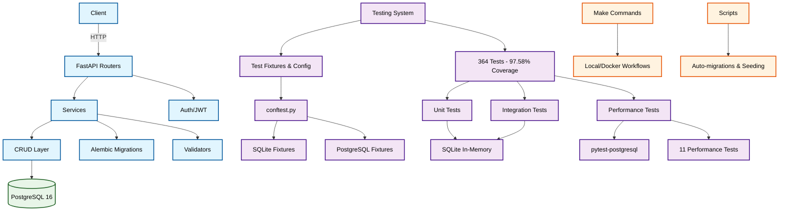

# BalanceHub — асинхронный REST API для управления пользователями, счетами и платежами


Проект реализует **асинхронный REST API** на FastAPI для аутентификации пользователей, управления пользователями (админ), счетами и платежами (пополнениями). Поддерживается обработка входящего вебхука от внешней платёжной системы с проверкой подписи и идемпотентной обработкой.

**Ключевые особенности:**
- 🚀 **Асинхронность** — полная поддержка async/await с SQLAlchemy 2.x
- 🔐 **Безопасность** — JWT аутентификация, bcrypt хеширование, валидация подписей
- 📊 **Высокое качество** — 97.58% покрытие тестами, 364 теста
- 🐳 **Docker-ready** — готовые контейнеры с PostgreSQL 16
- 📝 **Автодокументация** — OpenAPI/Swagger с примерами
- 🛠️ **Автоматизация** — Make команды для всех операций
- 🔧 **Скрипты** — автоматизация миграций и сидирования
- ⚡ **Performance тесты** — стресс-тесты и тесты производительности PostgreSQL

## Содержание
- [Архитектура и принципы](#архитектура-и-принципы)
- [Технологический стек](#технологический-стек)
- [Версионирование API и безопасность](#версионирование-api-и-безопасность)
- [Вебхук](#вебхук-подпись-и-идемпотентность)
- [Окружение и конфигурация](#окружение-и-конфигурация)
- [Установка и запуск](#установка-и-запуск)
- [Маршруты](#маршруты-основные)
- [Миграции](#миграции-alembic)
- [Сидирование тестовых данных](#сидирование-тестовых-данных)
- [Шпаргалка команд Make](#шпаргалка-команд-make)
- [Скрипты автоматизации](#скрипты-автоматизации)
- [Линтинг и pre-commit](#линтинг-и-precommit)
- [Тестирование](#тестирование)
- [Performance и стресс-тесты](#performance-и-стресс-тесты)
- [Переменные окружения](#переменные-окружения)
- [Примечания по безопасности](#примечания-по-безопасности)
- [Лицензия](#лицензия)

## Архитектура и принципы

**Принципы:** SOLID, DRY, KISS, REST, ООП, единая ответственность по файлам

**Слои и каталоги:**
- `app/core` — конфигурация, безопасность, общие зависимости (DI)
- `app/db` — декларативная база и сессии (async SQLAlchemy 2.x)
- `app/models` — ORM‑модели (`User`, `Account`, `Payment`)
- `app/schemas` — Pydantic v2 схемы запросов/ответов
- `app/crud` — классы CRUD для моделей (доступ к данным)
- `app/api/routers` — тонкие контроллеры (маршруты API), только DI/валидация/вызовы CRUD/утилит
- `app/services` — сложная прикладная логика (напр., обработка вебхука)
- `app/validators` — валидация данных
  - `sync/` — синхронные проверки формата/диапазонов
  - `async_/` — асинхронные проверки с использованием БД



## Технологический стек

**Основные:**
- **FastAPI** — современный веб-фреймворк
- **Pydantic v2** — валидация данных и схемы
- **SQLAlchemy 2.x** — async ORM с asyncpg
- **PostgreSQL 16** — основная БД
- **Alembic** — миграции БД

**Безопасность:**
- **JWT** (`python-jose`) — аутентификация
- **bcrypt** (`passlib`) — хеширование паролей

**Разработка:**
- **Poetry** — управление зависимостями
- **Ruff** — линтинг и форматирование
- **pytest** — тестирование (364 теста, 97.58% покрытие)
- **pytest-postgresql** — автоматическое управление тестовыми БД
- **pytest-asyncio** — поддержка async тестов
- **pre-commit** — git hooks

**📋 Полные версии всех зависимостей:** [`pyproject.toml`](pyproject.toml)

---

## Версионирование API и безопасность

- **Базовый префикс:** `/api/v1`
- **Аутентификация:** JWT Bearer токены
- **RBAC:** административные маршруты только для `is_admin = true`
- **ABAC:** политика доступа владельца или администратора

---

## Вебхук (подпись и идемпотентность)

**Путь:** `POST /api/v1/webhook/payment`

**Тело запроса:**
```json
{
  "transaction_id": "5eae174f-7cd0-472c-bd36-35660f00132b",
  "user_id": 1,
  "account_id": 1,
  "amount": "100.00",
  "signature": "7b47e41efe..."
}
```

**Подпись:** SHA256 от конкатенации значений в алфавитном порядке ключей и секретного ключа
`{account_id}{amount}{transaction_id}{user_id}{secret_key}`

**Идемпотентность:** при повторной передаче того же `transaction_id` возвращается ошибка 409 Conflict

---

## Окружение и конфигурация

### Автоматический выбор конфигурации (по приоритету):
1. **`ENV_FILE`** — принудительное использование
2. **`.env.docker`** — для Docker контейнеров
3. **`.env.local`** — для локального запуска
4. **`.env`** — fallback (если существует)

**Примеры файлов:**
- `.env.local.example` — для локального запуска
- `.env.docker.example` — для Docker запуска

### Основные переменные окружения:
- **Приложение:** `APP_NAME`, `ENV`, `DEBUG`, `CORS_ORIGINS`
- **Безопасность:** `JWT_SECRET`, `JWT_ALGORITHM`, `JWT_EXPIRES_MINUTES`, `WEBHOOK_SECRET_KEY`
- **БД:** `DB_ASYNC_DRIVER`, `DB_USER`, `DB_PASSWORD`, `DB_HOST`, `DB_PORT`, `DB_NAME`
- **Тестовые пользователи:** `DEFAULT_USER_*`, `DEFAULT_ADMIN_*`

---

## Установка и запуск

### 🚀 Быстрый старт

**Рекомендуется использовать Make команды:**

#### Docker (рекомендуется)
```bash
make docker-up        # build + DB + миграции + app
make docker-seed      # сидирование тестовых данных
make docker-logs      # логи приложения
make docker-down      # остановка сервисов
```

#### Локально
```bash
make local-up         # DB + миграции + uvicorn --reload
make local-seed       # сидирование тестовых данных
make local-logs-db    # логи БД
```

### 📖 Подробные инструкции

#### Вариант 1. Docker Compose (рекомендуется)
```bash
# 1. Клонирование и настройка
git clone git@github.com:AndreyZherdetskiy/balance-hub.git
cd balance-hub

# 2. Запуск (автоматически создаст .env.docker)
make docker-up

# 3. Сидирование данных
make docker-seed

# 4. Открыть:
# API: http://localhost:8000
# Swagger: http://localhost:8000/docs
```

#### Вариант 2. Локально
```bash
# 1. Зависимости
poetry install

# 2. Запуск БД и приложения
make local-up

# 3. Сидирование
make local-seed
```

---

## Маршруты (основные)

### 🔐 Аутентификация
- `POST /api/v1/auth/login` — вход по email/password
  - **Тело:** `{ "email": "user@example.com", "password": "Password123!" }`
  - **Ответ:** `{ "access_token": "<JWT>", "token_type": "bearer" }`

### 👥 Пользователи (админ)
- `POST /api/v1/admin/users` — создать пользователя
- `GET /api/v1/admin/users?limit&offset` — список пользователей
- `GET /api/v1/admin/users/{user_id}` — получить пользователя
- `PATCH /api/v1/admin/users/{user_id}` — обновить пользователя
- `DELETE /api/v1/admin/users/{user_id}` — удалить

### 💰 Счета
- `GET /api/v1/users/{user_id}/accounts?limit&offset` — список счетов пользователя
- `POST /api/v1/admin/users/{user_id}/accounts` — создать счёт (админ)

### 💳 Платежи
- `GET /api/v1/payments?limit&offset` — список моих платежей

### 🔗 Вебхук
- `POST /api/v1/webhook/payment` — обработка пополнения

**Полная спецификация:** Swagger UI `/docs` с примерами запросов и ответов

---

## Миграции (Alembic)

**Автоматическое создание начальной миграции:**
```bash
make local-migrate-init    # локально
make docker-migrate-init   # в Docker
```

**Применение:**
```bash
make local-migrate         # локально
make docker-migrate        # в Docker
```

**Откат:**
```bash
make local-migrate-down    # локально
make docker-migrate-down   # в Docker
```

**📝 Автоматизация:** Скрипт `scripts/create_init_migration.py` автоматически создает и исправляет миграции для локального и Docker окружений.

---

## Сидирование тестовых данных

**Автоматическое создание:**
- Тестового пользователя (`DEFAULT_USER_*`)
- Счета для пользователя
- Администратора (`DEFAULT_ADMIN_*`)

**Запуск:**
```bash
make local-seed      # локально
make docker-seed     # в Docker
```

**🌱 Скрипт:** `scripts/seed.py` автоматически создает тестовые данные с проверкой существования.

---

## Шпаргалка команд Make

### 🏠 Локальный workflow
| Команда                | Описание                                    |
|------------------------|---------------------------------------------|
| `make local-env`       | Создание .env.local из примера             |
| `make local-db-up`     | Запуск PostgreSQL через Docker             |
| `make local-wait-db`   | Ожидание готовности БД                     |
| `make local-migrate-init` | Создание init миграции                  |
| `make local-migrate`   | Применение миграций                        |
| `make local-up`        | Полный workflow: БД + миграции + API      |
| `make local-seed`      | Сидирование тестовых данных                |
| `make local-logs-db`   | Логи PostgreSQL                            |

### 🐳 Docker workflow
| Команда                | Описание                                    |
|------------------------|---------------------------------------------|
| `make docker-env`      | Создание .env.docker из примера            |
| `make docker-build`    | Сборка Docker образов                      |
| `make docker-db-up`    | Запуск PostgreSQL                          |
| `make docker-wait-db`  | Ожидание готовности БД                     |
| `make docker-migrate-init` | Создание init миграции в контейнере    |
| `make docker-migrate`  | Применение миграций в Docker               |
| `make docker-up`       | Полный workflow: сборка + БД + миграции + app |
| `make docker-seed`     | Сидирование в Docker                       |
| `make docker-logs-app` | Логи приложения                             |
| `make docker-logs-db`  | Логи PostgreSQL                            |
| `make docker-down`     | Остановка и очистка сервисов               |

### 🔧 Утилиты
| Команда                | Описание                                    |
|------------------------|---------------------------------------------|
| `make help`            | Справка по всем командам                    |
| `make local-migrate-down` | Откат миграций                          |
| `make docker-migrate-down` | Откат миграций в Docker                |

---

## Скрипты автоматизации

### 🔧 Основные скрипты

**`scripts/create_init_migration.py`**
- Автоматически создает init миграцию с правильными импортами
- Работает как локально, так и в Docker окружении
- Автоматически исправляет типы данных и импорты
- Устанавливает правильные права доступа в контейнерах

**`scripts/seed.py`**
- Создает тестовых пользователей и счета
- Использует переменные окружения для настройки
- Проверяет существование данных перед созданием
- Асинхронная работа с базой данных

### 🚀 Использование скриптов

```bash
# Прямой запуск
python scripts/create_init_migration.py
python scripts/seed.py

# Через Make команды (рекомендуется)
make local-up
make docker-up
make local-seed
make docker-seed
```

---

## Линтинг и pre‑commit

**Проверка качества кода:**
```bash
poetry run ruff check .          # линтинг
poetry run ruff format .         # форматирование
poetry run pre-commit run --all-files  # pre-commit hooks
```

**Установка hooks:**
```bash
poetry run pre-commit install
```

**Конфигурация:**
- **`.pre-commit-config.yaml`** — настройки pre-commit hooks
- **`pyproject.toml`** — настройки ruff и pytest
- **Ruff** — единый инструмент для линтинга и форматирования

**Настройки в pyproject.toml:**
- Длина строки: 99 символов
- Docstrings: Google style
- Кавычки: одинарные
- Python: 3.10+

**Pre-commit hooks:**
- **Ruff linting** — проверка и автоматическое исправление ошибок
- **Ruff formatting** — форматирование кода
- **Дополнительные проверки** — trailing whitespace, YAML валидация, merge conflicts

---

## Тестирование

**Результаты:**
- **364 теста** — все проходят успешно ✅
- **Покрытие:** 97.58% (превышает требуемые 90%)
- **Время выполнения:** ~2 минуты
- **Модули:** API, CRUD, Services, Models, Schemas, Validators

**Структура тестов:**
- **Unit тесты** для всех компонентов
- **Интеграционные тесты** полного flow (SQLite)
- **Performance тесты** PostgreSQL с pytest-postgresql
- **Валидация данных** и схем

**Фикстуры и конфигурация:**
- **`tests/conftest.py`** — централизованная конфигурация pytest
- **SQLite фикстуры** для unit и integration тестов
- **PostgreSQL фикстуры** для performance тестов
- **Автоматическая изоляция** тестов через очистку БД
- **Маркеры pytest** для классификации тестов

**Запуск по категориям:**
```bash
# Все тесты
poetry run pytest --tb=short -v

# Только unit тесты (SQLite)
poetry run pytest tests/ -k "not performance" -v

# Только integration тесты
poetry run pytest tests/test_integration_full_flow.py -v

# Только performance тесты (PostgreSQL)
poetry run pytest tests/test_performance.py -v
```

---

## Performance и стресс-тесты

**Запуск performance тестов:**
```bash
# Все performance тесты
poetry run pytest tests/test_performance.py -m slow -v

# Только стресс-тесты
poetry run pytest tests/test_performance.py -m stress -v

# Конкретный тест
poetry run pytest tests/test_performance.py::test_concurrent_webhook_requests_postgresql -v
```

**Возможности тестирования:**
- **PostgreSQL в контейнере** — изолированное тестирование производительности
- **Конкурентные запросы** — тест 100 одновременных вебхуков
- **Массовое создание** — тест создания 50 пользователей одновременно
- **Точность вычислений** — тест больших сумм и десятичной точности
- **Стресс-тесты** — идемпотентность, пул соединений, невалидные запросы

**Метрики производительности:**
- **Вебхуки:** >3 запроса/сек для 100 одновременных
- **Пользователи:** >0.8 пользователя/сек для массового создания
- **Платежи:** >0.1 платежа/сек для больших сумм
- **Профили:** >10 запросов/сек для быстрых последовательных

**Техническая реализация:**
- **pytest-postgresql** — автоматическое управление тестовыми БД
- **Асинхронные фикстуры** — `@pytest_asyncio.fixture` для async тестов
- **Автоматическая изоляция** — очистка данных между тестами
- **Оптимизированные настройки** — увеличенный пул соединений для performance
- **Интеграция с Alembic** — автоматическое создание схемы в тестовых БД

**Особенности:**
- Автоматическое создание и очистка PostgreSQL контейнеров
- Применение миграций Alembic к тестовым БД
- Изолированные настройки для каждого теста
- Детальная отчетность и отладка

---

## Переменные окружения

**Основные:**
- `APP_NAME`, `ENV`, `DEBUG`
- `CORS_ORIGINS` — список или `*`
- `JWT_SECRET`, `JWT_ALGORITHM`, `JWT_EXPIRES_MINUTES`
- `WEBHOOK_SECRET_KEY` — ключ для подписи вебхука

**База данных:**
- `DB_ASYNC_DRIVER`, `DB_USER`, `DB_PASSWORD`, `DB_HOST`, `DB_PORT`, `DB_NAME`
- Или полные `DATABASE_URL`/`SYNC_DATABASE_URL`

**Тестовые пользователи:**
- `DEFAULT_USER_*`, `DEFAULT_ADMIN_*` — для сидирования БД

---

## Примечания по безопасности

- **Секреты** хранить в `.env*` файлах, не коммитить
- **Пароли** хэшируются bcrypt с солью
- **Валидация** на всех уровнях:
  - Схемы/валидаторы: формат, диапазоны, регулярные выражения
  - Асинхронные валидаторы: бизнес-инварианты через DI
  - БД: уникальные индексы и констрейнты
- **CORS** настраивается через переменные окружения
- **JWT** токены с настраиваемым временем жизни

---

## 🚀 Возможности для развития

- Расширение API endpoints
- Добавление новых типов платежей
- Интеграция с внешними платежными системами
- Мониторинг и логирование
- CI/CD pipeline
- Расширение performance тестов
- Добавление метрик производительности
- Расширение фикстур для новых типов тестов
- Интеграция с другими БД для тестирования
- Автоматизация тестов в CI/CD pipeline

---

## Авторы
- [Andrey Zherdetskiy](https://github.com/AndreyZherdetskiy)

---

## Лицензия

MIT
